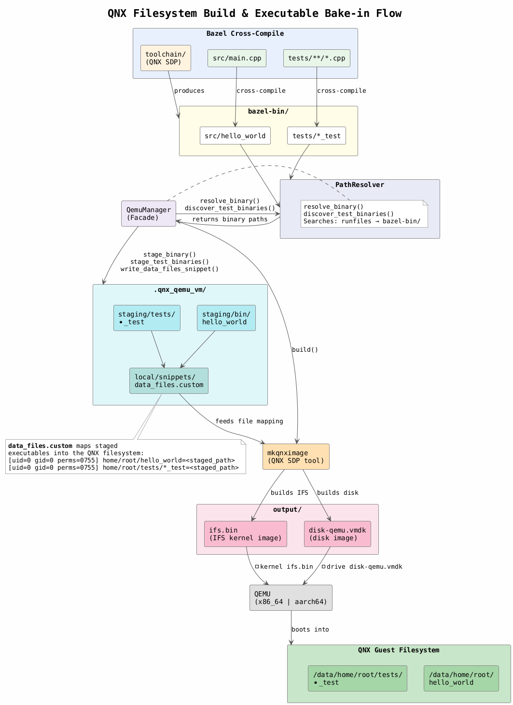

# QNX QEMU — Technical Reference

QNX and QEMU tools, image formats, virtual devices, and acceleration
used to build and run the QNX virtual machine.



---

## QNX Image Build (`mkqnximage`)

The QNX SDP ships a tool called **`mkqnximage`** (located at
`<QNX_ROOT>/host/common/bin/mkqnximage`) that produces a bootable
QEMU-ready image from scratch.

### What `mkqnximage` produces

| Artifact | Description |
|---|---|
| `output/ifs.bin` | **IFS (Image Filesystem)** — the QNX micro-kernel boot image. Contains the kernel (`procnto-smp-instr`), early drivers, and the startup sequence. Loaded directly by QEMU via `-kernel`. |
| `output/disk-qemu.vmdk` | **VMDK disk image** — a virtual hard disk containing the full QNX root filesystem (`/`, `/data/`, …). Mounted at runtime by the appropriate block driver. |

### Invocation

```bash
mkqnximage \
    --type=qemu \
    --arch=x86_64          # or aarch64le \
    --ssh-ident=~/.ssh/id_ed25519.pub \
    --noprompt --force --clean --build
```

Runs inside the `.qnx_qemu_vm/` workspace directory. The `--clean` flag
wipes previous build artefacts, and `--build` triggers the actual image
assembly.

### Environment prerequisites

`mkqnximage` depends on `QNX_TARGET` and `QNX_HOST` being set.
These are provided by sourcing the SDK's `qnxsdp-env.sh`:

```bash
source ~/qnx800/qnxsdp-env.sh
```

---

## Baking Executables into the Filesystem

Custom binaries are injected into the disk image through
**mkqnximage snippets** — small config files placed under
`local/snippets/` in the workspace directory.

### `data_files.custom`

This snippet defines how staged files map into the QNX filesystem:

```
# Custom binaries baked into the QNX image
[uid=0 gid=0 perms=0755] home/root/hello_world=/path/to/staging/bin/hello_world

# Test binaries
[uid=0 gid=0 perms=0755] home/root/tests/stl_test=/path/to/staging/tests/stl_test
[uid=0 gid=0 perms=0755] home/root/tests/threading_test=/path/to/staging/tests/threading_test
```

Each line specifies:
- **Permissions** — `uid=0 gid=0 perms=0755` (root-owned, executable)
- **Guest path** — relative to `/data/` (e.g. `home/root/hello_world` → `/data/home/root/hello_world`)
- **Host source** — absolute path to the staged binary on the build host

`mkqnximage` reads these snippets during the `--build` phase and packs
the referenced files into the VMDK disk image.

---

## QEMU Virtual Machine Configuration

### Machine Types

| Architecture | Machine | Notes |
|---|---|---|
| x86_64 | i440FX (QEMU default) | Standard PC chipset. No `-machine` flag needed. |
| aarch64 | `virt-4.2` | ARM virtual platform. Matches QNX's official `runimage` script. |

### Virtual Devices

#### Storage

| Architecture | Device | QEMU flag | QNX driver |
|---|---|---|---|
| x86_64 | **IDE** | `-drive file=disk.vmdk,if=ide,id=drv0` | `devb-eide` |
| aarch64 | **virtio-blk (MMIO)** | `-drive file=disk.vmdk,if=none,format=vmdk,id=drv0 -device virtio-blk-device,drive=drv0` | `devb-virtio` |

The aarch64 `virt` machine has no PCI bus — all devices use MMIO
(Memory-Mapped I/O) virtio transports instead of PCI.

#### Networking

| Architecture | Device | Transport |
|---|---|---|
| x86_64 | `virtio-net-pci` | PCI |
| aarch64 | `virtio-net-device` | MMIO |

Both use **user-mode networking** (`-netdev user`), which requires no
host-side bridge, libvirt, or root privileges. SSH is forwarded from the
host into the guest:

```
-netdev user,id=net0,hostfwd=tcp::2222-:22
-device virtio-net-pci,netdev=net0       # x86_64
-device virtio-net-device,netdev=net0    # aarch64
```

After boot: `ssh -p 2222 root@localhost`

#### Random Number Generator

| Architecture | Device | Transport |
|---|---|---|
| x86_64 | `virtio-rng-pci` | PCI |
| aarch64 | `virtio-rng-device` | MMIO |

Backed by the host's `/dev/urandom`:

```
-object rng-random,filename=/dev/urandom,id=rng0
-device virtio-rng-pci,rng=rng0       # x86_64
-device virtio-rng-device,rng=rng0    # aarch64
```

Provides entropy to the QNX guest for cryptographic operations and
`/dev/random`.

#### Serial Console

```
-serial mon:stdio -nographic
```

No graphical display. The QNX console is attached to the host terminal
via serial. The QEMU monitor is multiplexed on the same channel
(`mon:stdio`), accessible via **Ctrl-A** shortcuts:

| Shortcut | Action |
|---|---|
| `Ctrl-A X` | Quit QEMU |
| `Ctrl-A C` | Toggle between guest console and QEMU monitor |
| `Ctrl-A H` | Show help |

---

## IFS Boot (`-kernel`)

QEMU loads the IFS directly as a kernel image:

```
-kernel output/ifs.bin
```

The IFS contains:
- **QNX Neutrino micro-kernel** (`procnto-smp-instr`)
- **Startup code** — hardware detection and driver initialisation
- **Early-boot drivers** — block, network, serial
- **Shell and utilities** — `ksh`, core QNX commands

On boot, the kernel starts, mounts the VMDK disk image as the root
filesystem, and drops into a login shell on the serial console.

---

## Acceleration (KVM)

### Same-architecture (e.g. x86_64 host → x86_64 target)

```
--enable-kvm --cpu host
```

Uses the Linux KVM hypervisor for near-native performance. Requires
`/dev/kvm` to exist and be writable by the current user
(see setup instructions in [README.md](README.md#2-enable-kvm-acceleration-same-arch-only)).

### Cross-architecture (e.g. x86_64 host → aarch64 target)

```
--cpu cortex-a57    # aarch64 target
--cpu max           # x86_64 target on non-x86 host
```

Falls back to QEMU's TCG (Tiny Code Generator) software emulation.
Fully functional but significantly slower — suitable for testing, not
performance benchmarking.

---

## Full QEMU Command (x86_64 example)

```bash
qemu-system-x86_64 \
    -smp 2 \
    --enable-kvm --cpu host \
    -m 1G \
    -kernel .qnx_qemu_vm/output/ifs.bin \
    -drive file=.qnx_qemu_vm/output/disk-qemu.vmdk,if=ide,id=drv0 \
    -netdev user,id=net0,hostfwd=tcp::2222-:22 \
    -device virtio-net-pci,netdev=net0 \
    -object rng-random,filename=/dev/urandom,id=rng0 \
    -device virtio-rng-pci,rng=rng0 \
    -serial mon:stdio -nographic \
    -pidfile .qnx_qemu_vm/output/qemu.pid
```

## Full QEMU Command (aarch64 example)

```bash
qemu-system-aarch64 \
    -machine virt-4.2 \
    -smp 2 \
    --cpu cortex-a57 \
    -m 1G \
    -kernel .qnx_qemu_vm/output/ifs.bin \
    -drive file=.qnx_qemu_vm/output/disk-qemu.vmdk,if=none,format=vmdk,id=drv0 \
    -device virtio-blk-device,drive=drv0 \
    -netdev user,id=net0,hostfwd=tcp::2222-:22 \
    -device virtio-net-device,netdev=net0 \
    -object rng-random,filename=/dev/urandom,id=rng0 \
    -device virtio-rng-device,rng=rng0 \
    -serial mon:stdio -nographic \
    -pidfile .qnx_qemu_vm/output/qemu.pid
```

---

## Summary: x86_64 vs aarch64

| | x86_64 | aarch64 |
|---|---|---|
| QEMU binary | `qemu-system-x86_64` | `qemu-system-aarch64` |
| Machine | i440FX (default) | `virt-4.2` |
| mkqnximage `--arch` | `x86_64` | `aarch64le` |
| Bus model | PCI | MMIO (no PCI) |
| Disk | IDE (`devb-eide`) | virtio-blk-device (`devb-virtio`) |
| Network | `virtio-net-pci` | `virtio-net-device` |
| RNG | `virtio-rng-pci` | `virtio-rng-device` |
| KVM | on x86_64 host | on aarch64 host only |
| Emulated CPU | `max` (if no KVM) | `cortex-a57` |
