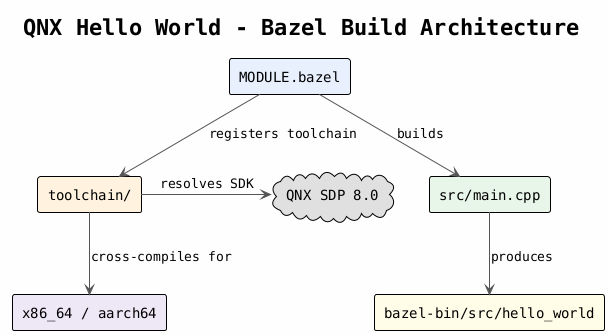

# src — Demo Binary

Cross-compiled C++ hello world for QNX 8.0 (x86_64 and aarch64).

## Supported Platforms

| Config | Target |
|---|---|
| `qnx_x86_64` | QNX on Intel/AMD 64-bit |
| `qnx_aarch64` | QNX on ARM 64-bit |

## Prerequisites

- Bazel 8+
- QNX SDP 8.0 installed at `$HOME/qnx800` (or set `QNX_ROOT` / source `qnxsdp-env.sh`)

## Build

```bash
# x86_64
bazel build //src:hello_world --config=qnx_x86_64

# aarch64 (ARM)
bazel build //src:hello_world --config=qnx_aarch64
```

Output binary: `bazel-bin/src/hello_world`

## Architecture



See [doc/bazel/bazel_architecture.puml](../doc/bazel/bazel_architecture.puml) for the PlantUML source.
