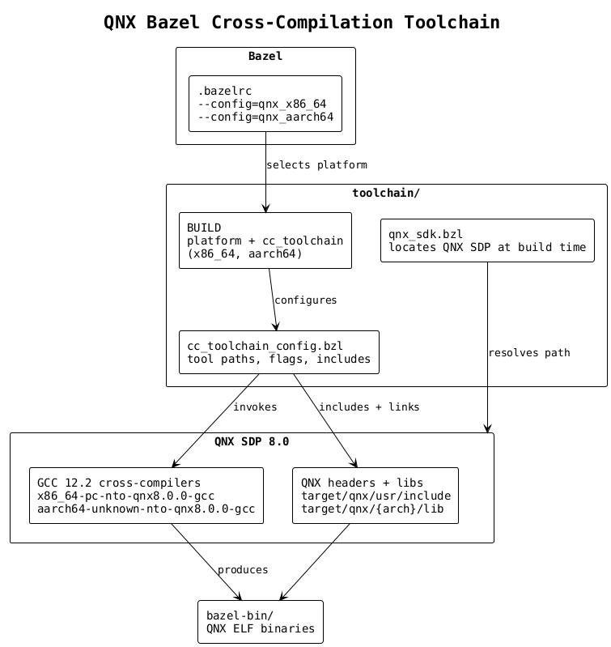

# toolchain — QNX Bazel Cross-Compilation

Bazel toolchain that cross-compiles C++ for QNX Neutrino 8.0 on x86_64 and aarch64.



## How It Works

- **`qnx_sdk.bzl`** — Repository rule that locates the QNX SDP at build time. Checks `QNX_ROOT`, `QNX_TARGET`, `QNX_HOST` env vars, falls back to `$HOME/qnx800`.
- **`cc_toolchain_config.bzl`** — Configures the GCC 12.2 cross-compiler shipped with the SDP. Sets tool paths, target triples, compile defines, link flags, include directories, and injects `QNX_HOST`/`QNX_TARGET` env vars into all build actions.
- **`BUILD`** — Declares two platforms (`qnx_x86_64`, `qnx_aarch64`) and their corresponding `cc_toolchain` + `toolchain` targets. Execution host is always Linux x86_64.

## Target Architectures

| Config | Triple | Target dir | Defines |
|---|---|---|---|
| `qnx_x86_64` | `x86_64-pc-nto-qnx8.0.0` | `x86_64` | `__QNXNTO__`, `__X86_64__`, `_QNX_SOURCE` |
| `qnx_aarch64` | `aarch64-unknown-nto-qnx8.0.0` | `aarch64le` | `__QNXNTO__`, `__aarch64__`, `_QNX_SOURCE` |

## Tools Resolved from QNX SDP

All tools live under `<QNX_ROOT>/host/linux/x86_64/usr/bin/`:

`gcc`, `ld`, `ar`, `cpp`, `nm`, `objdump`, `strip`

## Include Directories

```
<QNX_ROOT>/target/qnx/usr/include
<QNX_ROOT>/target/qnx/usr/include/c++/12.2.0
<QNX_ROOT>/target/qnx/usr/include/c++/12.2.0/<triple>
<QNX_ROOT>/host/linux/x86_64/usr/lib/gcc/<triple>/12.2.0/include
<QNX_ROOT>/host/linux/x86_64/usr/lib/gcc/<triple>/12.2.0/include-fixed
```

## Link Libraries

`-lc++`, `-lm`, linked against `<QNX_ROOT>/target/qnx/<arch>/lib` and `<QNX_ROOT>/target/qnx/<arch>/usr/lib`.
